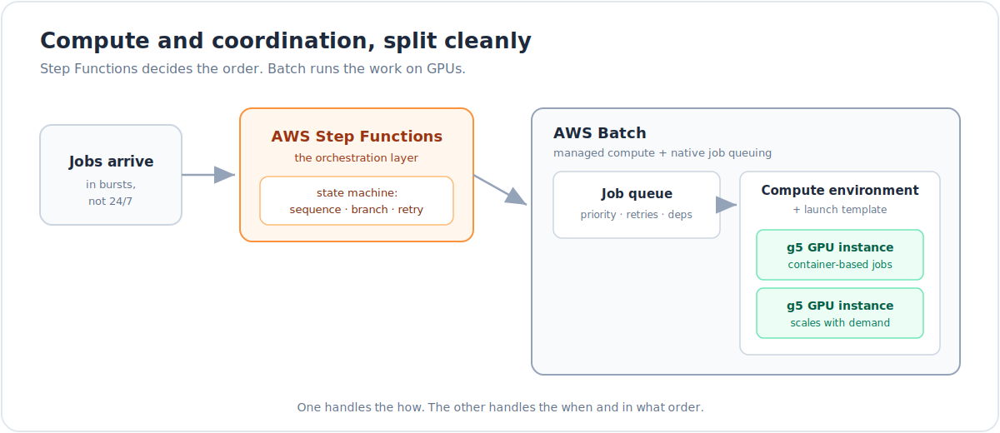
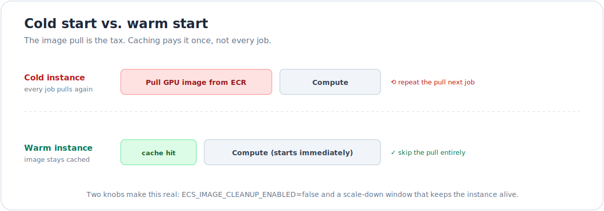
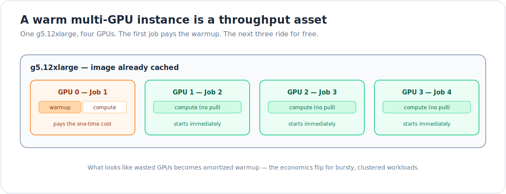

Running GPU jobs in the cloud looks simple at first. It rarely is. Queues get slow. Costs creep up. Instances behave in ways you do not expect.

This post walks through how I set up GPU batch processing so it was fast, cheaper, and reliable. It also covers the three changes that actually moved the needle.

## The problem: heavy GPU jobs, not constant traffic

My workload was not a steady stream. Jobs arrived in bursts. Sometimes a bunch at once. Sometimes nothing for a while. The compute needs were real and big. They just were not 24/7.

That left a few bad choices:

- Keep a GPU instance running all the time and burn money when idle.
- Start EC2 instances by hand for each job and take on all the ops work.
- Write a custom queue with my own logic for retries and concurrency.

None of that felt right. I needed something that could sit quiet when no work was there. It should wake up on new jobs, run things in order, handle retries, and not need manual care.

## Why AWS Batch made sense

AWS Batch is built for this kind of pattern. It manages the lifecycle of compute for you. Instances come up when jobs arrive. They go away when there is no work.

For GPU jobs this works well. Batch supports GPU instance families and runs everything as containers. Jobs run in the same environment every time. No custom setup per run.

A few parts were key.

**Job queues with real controls.** Batch gives you job queues with priorities, retry settings, and job dependencies. No polling scripts. No custom schedulers. No guessing what ran.

**Compute environments with launch templates.** You can attach a launch template to a compute environment. This gives control over userdata, EBS volumes, and ECS agent config. That control became important later.

**GPU resource targeting.** In the job definition you say how many GPUs a job needs. Batch handles the scheduling. For my case the `g5` family worked well. Enough GPU memory and good throughput.

## Step Functions for orchestration

Batch runs jobs. It does not decide what should run next.

For that I used AWS Step Functions. Real workloads are pipelines. They have steps and branches. They need retries and error handling.

Step Functions gave me a state machine to model that:

- Run jobs in sequence and pass outputs forward.
- Branch on success or failure without custom code.
- Handle retries with backoff at the workflow level.
- See where a pipeline is stuck or moving.

Batch handled how jobs run. Step Functions handled when they run and in what order.

## Where things broke and how we fixed them

The setup on paper looks clean. In practice the first version was slower and more expensive than it should have been. Some instance behavior was also not obvious until we looked closer.

Here are the three main problems. And what fixed them.

### Problem 1: Image pulls slowed every job

Each job pulled the Docker image from ECR before it could start. The image was large. It had CUDA, ML libraries, and other tools. The pull took time. For a single job it was already noticeable. For a busy queue it was painful.

The root cause was ECS image cleanup.

By default the ECS agent on the Batch instance removes Docker images from time to time. This frees disk space. That is fine for long running services. For batch GPU jobs it hurts. You actually want the image to stay on disk so the next job can reuse it.

The fix was to disable image cleanup.

Set `ECS_IMAGE_CLEANUP_ENABLED=false` in `/etc/ecs/ecs.config`.

The clean way to do this is in userdata inside the launch template. The instance boots, reads the config, and starts ECS with cleanup turned off. The image then stays cached.

After that change the first job on a new instance still pulls the image. Jobs that follow on the same instance skip the pull and start compute right away.

### Problem 2: Scale-down removed the cache benefit

Caching helps only if the instance stays alive long enough. Our compute environment scaled down fast. When a job finished the instance often shut down. The next job then got a fresh instance and a fresh pull. We were back to cold starts.

The fix was to adjust scale-down behavior.

Instead of killing instances as soon as there were no jobs, we kept them alive for a short window. During this time the image stayed cached. If new jobs arrived, they landed on a warm instance and skipped the pull.

This is a tradeoff. You pay for some idle time. In return you get lower latency and better throughput during bursts. For workloads that come in clusters this works well.

I also wanted this to be flexible. So the scale-down window is configurable from the app.

- If I expect a quiet phase I reduce the window. Idle instances shut down fast.
- If I expect a spike I increase the window. Instances stay warm for longer.

The control lives next to the usage signal. So the cost of warm instances appears only when it brings value.

### Problem 3: Multi-GPU instances looked wasteful

A `g5.12xlarge` has four GPUs. A single GPU job uses one. At first this looked bad. You pay for four GPUs. One is busy. Three are idle.

The simple view is that multi-GPU instances are not good for single GPU jobs. With caching and warm instances that view changes.

Once you:

- Keep images cached, and
- Keep instances warm for a short time

a multi-GPU node turns into a throughput boost.

The first job on that node pays the warmup cost. Instance launch plus image pull. After that three GPUs are still free. The next three jobs can start right away.

No new instances. No extra image pulls. Just scheduling and compute.

For bursty workloads this is a big shift. You do not pay the warmup cost four times on four machines. You pay once and reuse it across all GPUs on that node.

## How it behaved after the fixes

With all three changes in place the system behaved very differently.

- The first job on a new instance still has a warmup cost.
- Jobs after that on the same instance start at compute.
- The scale-down window keeps instances alive just long enough to catch bursts.
- On multi-GPU nodes the warmup cost spreads across several jobs.

Queues moved faster. The cost per job dropped. Bursts felt smoother with less random latency.

## The bigger takeaway

AWS Batch gives you managed compute and native job queues. Step Functions gives you a solid way to build pipelines. The jump from “it works” to **“it works well”** came from three small but important tweaks:

1. **Turn off image cleanup** so large GPU images stay cached.
2. **Tune scale-down** so instances stay warm when bursts are likely.
3. **Use multi-GPU instances for throughput** once caching is in place.

These details do not stand out in the basic docs. In practice they made a clear difference.