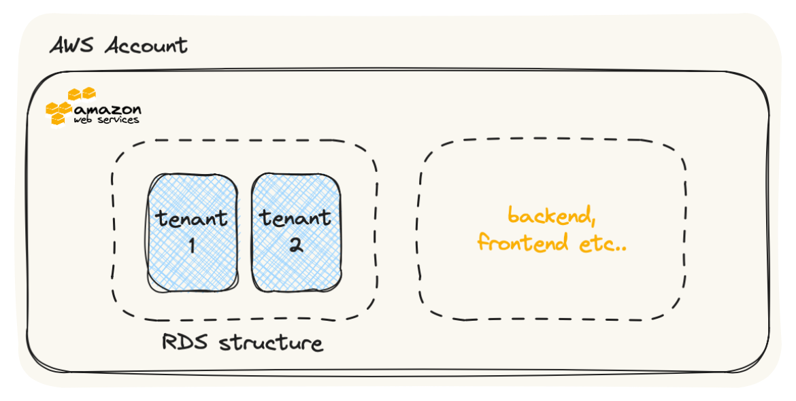
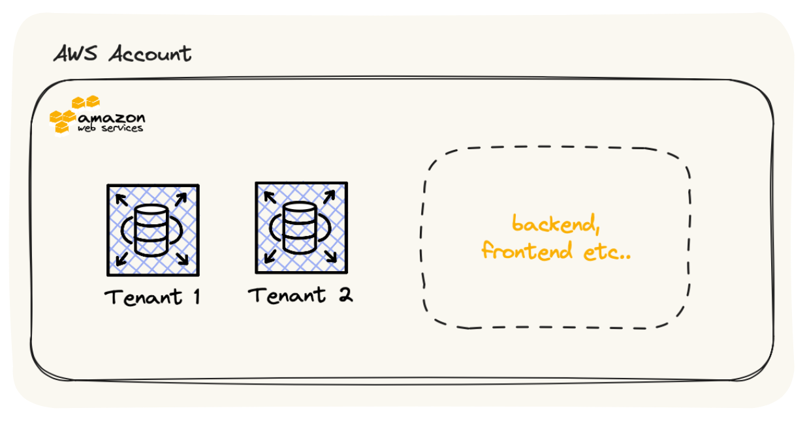
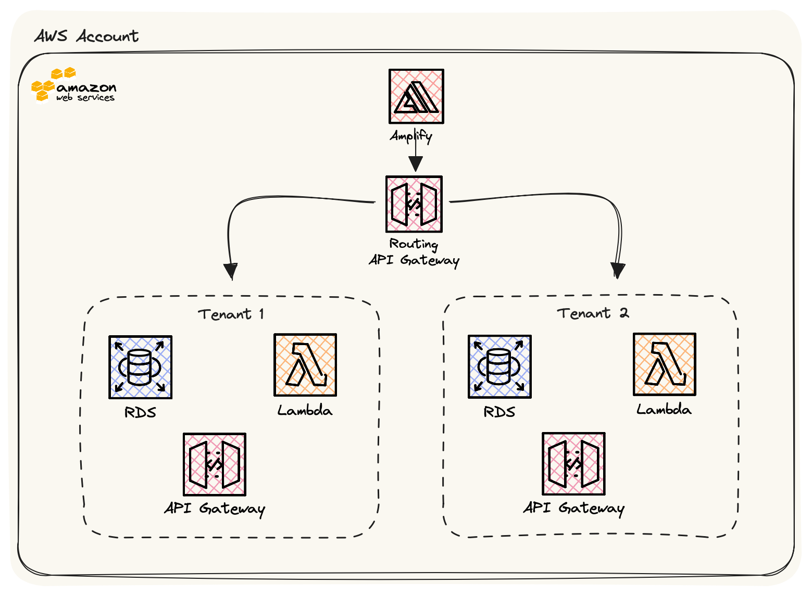

Multi-tenancy in the cloud is akin to running multiple, separate offices within a shared workspace. In technical terms, it means deploying a single software application or service that serves numerous users or clients, all isolated from one another. This approach maximises resource utilisation and cost-efficiency by sharing infrastructure and codebase.

## MLT Architectures
---

**Single Database, Separate Schemas**: In this approach, a single database is used to store data for all tenants, but each tenant has its own schema within the database. This architecture provides strong isolation between tenants while allowing efficient data management. It's suitable for scenarios where tenants have similar data structures but need data separation.

**Database-per-Tenant**: Each tenant has its own dedicated database instance. This approach offers the highest level of data isolation but can be resource-intensive and costly. It's suitable for scenarios where strict data separation is required.

**Micro-services with API Gateway**: Tenants are served by separate microservices, each with its own database. An API gateway manages tenant-specific routing and authentication. This approach provides flexibility, scalability, and strong isolation.

**Account level isolation**: A multi-tenancy architecture with separate AWS accounts involves assigning each tenant or customer their own dedicated AWS account. This architecture ensures robust isolation, security, and scalability between tenants. Each tenant manages their AWS resources independently, with IAM policies enforcing access control. Network isolation is achieved using separate VPCs. Monitoring, billing, and disaster recovery are handled individually for each tenant, allowing for customised solutions. This approach is ideal for scenarios where data separation and security are paramount, such as SaaS applications or managed service providers.

The Approach we will be looking today is **Account Level Isolation.**
