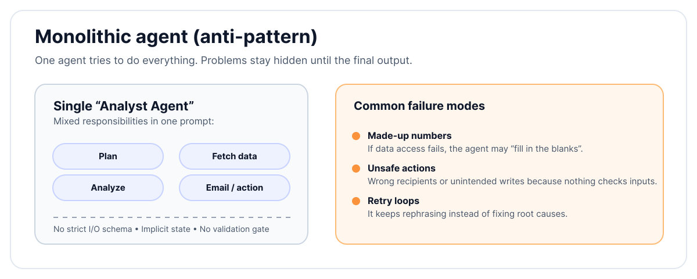
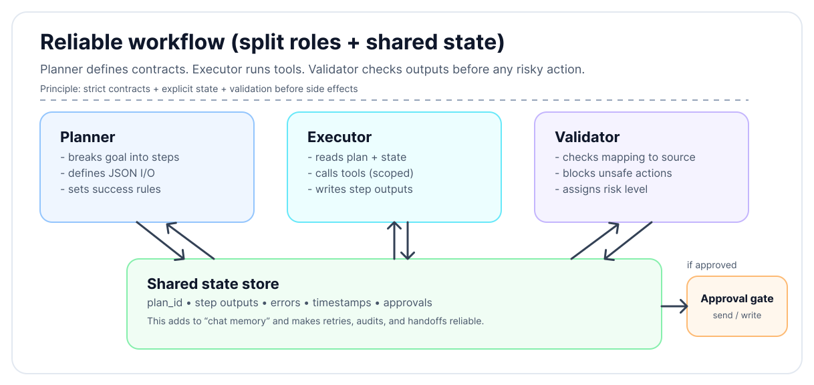
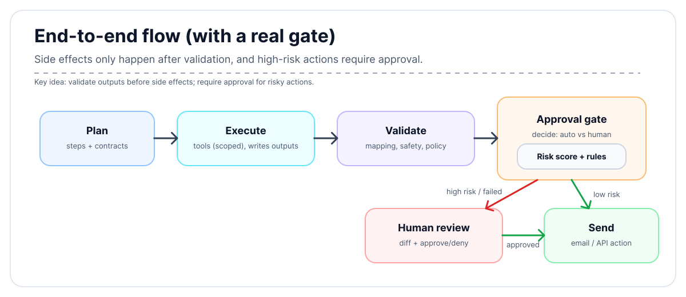

Hi there!

In this post, I'll show you how to design reliable workflows that improve agent performance. We'll cover how to fix vague roles, enforce strict inputs/outputs, and manage state explicitly.

## Why agents fail

Most failures come from design, not intelligence.

- Vague roles confuse agents. If one agent has to plan, do the work, and judge the result, it often loses focus and goes off track.
- Loose inputs and outputs hide problems. Free-form text makes it easy to sound right while being wrong.
- Missing state causes loops. If the system doesn’t track what ran and what failed, it repeats the same mistakes.
- No guardrails means risky actions slip through. With unchecked access, one bad step can cause real damage fast.
- Weak error handling makes failures messy. Blind retries and late escalation lead to quiet breakage or endless retries.

## When do you need this?

Not every task needs three agents and a state machine. If you just need to "summarize this text" or "write a haiku," a single prompt is fine.

Use this structured workflow when the task is:
- **Complex and multi-step**: Requires planning, research, and synthesis (e.g., "Plan a travel itinerary").
- **High risk**: Involves sending emails, making purchases, or modifying data.
- **Long-running**: Needs to run for minutes or hours without losing context.
- **Data-heavy**: Involves querying databases, analyzing large datasets, or cross-referencing multiple sources.

## A bad workflow (what not to do)

> **Goal**: Pull product metrics, analyze them, and email a summary to the team.

**Design**: A single “analyst agent” with a broad prompt:
> “You are an expert analyst. Gather metrics, analyze them, write a summary, and email the team.”



### What could go wrong

The workflow crumbles quickly. Wrong tables are queried because the prompt is vague, and metrics are invented when data access fails. The write-up might sound professional but contains fake numbers. Worse, emails often go to wrong recipients due to parsing errors. When failures occur, the agent simply retries with new wording, entering an endless loop.

### Root causes

This failure stems from a lack of structure. There is no split between planning, execution, and validation. Without clear input/output formats or success rules, the agent guesses. Explicit state like “data fetched” or “email sent” is missing, and there is no write protection or approval for emails. Instead of structured failure, the only strategy is "try again."

## A better workflow (step by step)

Use three small agents, each with one job:

1.  **Planner agent** – decides steps and defines inputs and outputs
2.  **Executor agent** – runs steps with limited access
3.  **Validator agent** – checks outputs and blocks unsafe actions



### 1. Define clear inputs and outputs

Every step needs a small contract:
- **Input format**: typed JSON fields
- **Output format**: JSON with a fixed schema
- **Success condition**: true/false with a reason

Avoid free-form text at the interface level. Natural language can exist inside fields, but the structure must be strict.

**Example: Fetch weekly metrics**

*   **Input**
    ```json
    { "week_start": "ISO date", "metrics": ["active_users", "revenue"] }
    ```
*   **Output**
    ```json
    { "success": boolean, "data": { "active_users": number, "revenue": number }, "errors": [string] }
    ```

**Success rule**: Success is true, all fields exist, and values fall within expected ranges.

### 2. Manage state explicitly

Store state in a place all agents can read. Keep track of `done` steps (outputs and timestamps), `failed` attempts (errors with codes), `pending` items, and `notes` (links/assumptions).

Never rely on only chat memory. Each agent reads state at the start and writes state at the end. Use IDs for steps and outputs so everything is traceable.

### 3. Guardrails by default

Security should be baked in. Start with **read-only access scopes**, granting write access only when needed. Enforce **tool limits** by allowing only whitelisted tools with strict schemas. Require **human approval** for high-risk actions like emails or external calls. Implement **rate limits** to prevent retry storms, and use **content rules** to block PII leaks or unsafe text.

### 4. Failure handling that ends cleanly

Failures should be expected and designed for. Limit **retries** by error type with backoff, and allow only **one change per retry** never rewrite the whole plan. **Escalate** after N failures, stopping to hand off context. Ensure a **safe exit** where, if assumptions break, the workflow terminates without loops or made-up data.

## Putting it together: a concrete flow

### A) Planning

The planner receives the high-level goal and converts it into a structured checklist.

**Input**: `task = "Weekly metrics summary email"`

**Output**:
```json
{
  "plan_id": "plan_123",
  "steps": [
    { "step": 1, "action": "fetch_metrics", "params": { "range": "last_7_days" }, "status": "pending" },
    { "step": 2, "action": "analyze_trends", "params": { "focus": ["growth", "churn"] }, "status": "pending" },
    { "step": 3, "action": "draft_email", "params": { "template": "weekly_summary" }, "status": "pending" }
  ]
}
```

### B) Execution (read-only first)

The executor picks up pending steps one by one. It reads the shared state, calls the necessary tools, and writes the output back to state.

It first **fetches the metrics**, then **analyzes trends**, and only then **drafts the email** using the fetched data.

**Action**: `draft_email`
**Result**:
```json
{
  "step": 3,
  "action": "draft_email",
  "success": true,
  "output": {
    "subject": "Weekly Metrics: +5% Growth",
    "body": "Hi Team, Active users are up to 10,500...",
    "recipients": ["team@company.com"]
  },
  "timestamp": "2025-12-15T10:05:00Z"
}
```

(Note: No emails are sent yet. The executor only produces data and drafts.)

### C) Validation

The validator reviews the drafted email against safety rules and data mapping.

**Check**: `draft_email` output vs `fetch_metrics` data
**Rules**:
1.  **Data Mapping**: Do the numbers in the email body match the fetched JSON data?
2.  **Safety**: No PII (Personally Identifiable Information) or leaked secrets.
3.  **Policy**: Recipients match the internal allow-list etc.

**Validation Result**:
```json
{
  "validation_id": "val_456",
  "plan_id": "plan_123",
  "validated_step": 3,
  "approved": true,
  "risk_level": "low",
  "reason": "Draft matches source data. No sensitive info found."
}
```

### D) Approval and sending

The final gatekeeper decides whether to proceed based on the validation result.

- **Low risk**: Auto-send via the API.
- **High risk** (or validation failed): Trigger a human approval request with a diff of the proposed email.



## Best Practices for Reliability

### 1. Implementation Tips

**Give the agent a "Task Tracker" tool**
Instead of asking the agent to remember the plan in its context window, give it a tool to read and write to a persistent checklist.
- **Map the work**: The agent calls `create_tasks([...])` to lock in the plan.
- **Track progress**: It calls `complete_task(id)` after every success.
- **Ensure completion**: Before finishing, it calls `get_pending_tasks()` to verify nothing was missed.

This externalizes memory, making the agent robust against distractions and context limits.

**Treat prompts like code**
Prompts are logic. Version control them, review changes in PRs, and test them against golden datasets. Don't let prompts live in database strings or loose variables.

**Prefer deterministic tools**
Reliability drops when tools are fuzzy. Prefer structured APIs over web scraping. If you must parse text, wrap it in a dedicated "extraction" agent that outputs JSON.

### 2. Common pitfalls to avoid

| Pitfall | Fix |
| :--- | :--- |
| “One agent is simpler” | It isn’t. Split roles. |
| “We’ll pass chat history” | Persist real state instead. |
| “We need creative freedom” | Keep creativity inside strict containers. |
| “Retries will fix it” | Retry less, with better signals. |
| “Humans slow things down” | Humans prevent costly mistakes. |

### 3. Reliability Checklist

- Clear roles: Planner, Executor, Validator
- Contracts for every step
- Explicit state, no chat memory
- Read-only by default, limited writes
- Structured failures and safe exits
- Traceable IDs and logs
- Data sanity checks
- Per-step access control
- Tests for bad inputs and edge cases
- Regular audits of failures and near misses

## Closing thought

Reliable agent systems are built like reliable software systems. Separation of concerns, Strict interfaces, Explicit state and Careful access.

Models help, but workflows carry the weight. Design the workflow assuming it will fail and it won't surprise you when it tries.

---

Thanks for reading! 🎉

If you're building agent workflows, I hope these patterns help you create more reliable systems. Remember: good design beats clever prompts every time. If you have questions or want to share your own reliability patterns, feel free to reach out!
